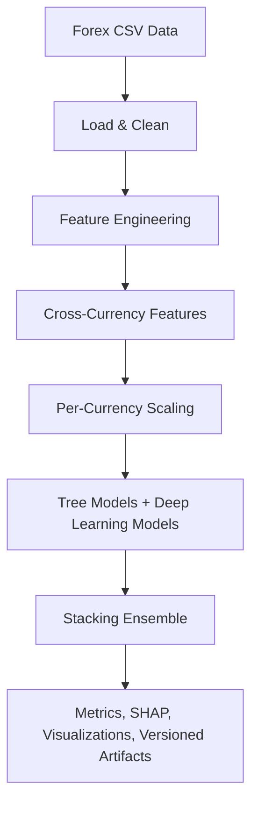

# 📈 Forex Ensemble Prediction

[](https://www.python.org/downloads/)
[](./.github/workflows/ci.yml)
[](./Dockerfile)
[](https://opensource.org/licenses/MIT)

A production-oriented forex exchange-rate prediction system built around a stacked ensemble of deep learning and tree-based models. The project now includes modular architecture, configurable feature engineering, experiment tracking, CI, Docker support, and versioned inference artifacts. [cite:39][cite:40]

## Overview

This repository predicts forex exchange rates using a multi-model pipeline that combines GRU, LSTM, BiLSTM with attention, Transformer, TFT, XGBoost, and LightGBM, then blends them with a stacking meta-learner. The current codebase also includes per-currency scaling, cross-currency features, SHAP ranking utilities, MLflow helpers, and a CLI-based `main.py` / `predict.py` workflow. [cite:39]

## Repository Structure

```text
.
├── .github/workflows/ci.yml
├── config/features.yaml
├── main.py
├── predict.py
├── Dockerfile
├── src/
│   ├── data/
│   ├── evaluation/
│   ├── features/
│   ├── mlops/
│   ├── models/
│   └── utils/
├── tests/
├── Dataset/
└── README.md
```

Key areas:
- `src/data/` handles dataset loading and cleaning.
- `src/features/` contains feature engineering, cross-currency features, and SHAP ranking helpers.
- `src/models/` defines tree models and deep learning builders.
- `src/evaluation/` contains metrics and visualizations.
- `src/mlops/` adds experiment tracking and versioned artifact helpers. [cite:39]

## Architecture



## Features

- Multi-model ensemble with GRU, LSTM, BiLSTM-Attn, Transformer, TFT, XGBoost, and LightGBM. [cite:39]
- Config-driven feature engineering via `config/features.yaml`. [cite:39]
- Per-currency outlier removal and per-currency scaling for stronger normalization across currencies. [cite:39]
- Cross-currency feature support and SHAP-based feature ranking utilities. [cite:39]
- CLI entry points for training and inference. [cite:39]
- GitHub Actions CI, Docker support, MLflow tracking helpers, and versioned model outputs. [cite:39]

## Installation

### Local setup

```bash
git clone https://github.com/gokulsenthilkumar3/Forex-Ensemble-Prediction.git
cd Forex-Ensemble-Prediction
pip install -r requirements.txt
```

### Core dependencies

The repository uses pinned dependencies including `tensorflow`, `xgboost`, `lightgbm`, `optuna`, `shap`, `mlflow`, `pytest`, `flake8`, `black`, and `isort`. [cite:39]

## Dataset

The repository contains a `Dataset/` directory and expects CSV-based forex data that includes `date`, `currency_code`, and `exchange_rate` columns for the main pipeline. The loader also drops an optional `currency` column if present. [cite:39]

Example expected schema:

```csv
date,currency_code,exchange_rate
2024-01-01,USD,83.10
2024-01-02,USD,83.12
2024-01-01,EUR,90.45
```

## Training

Run the training pipeline with:

```bash
python main.py --data Forex_Data.csv --output outputs --config config/features.yaml
```

Useful options:

```bash
python main.py --help
python main.py --data Forex_Data.csv --epochs 40 --timesteps 15 --log-level INFO
python main.py --data Forex_Data.csv --output outputs --test-ratio 0.2
```

`main.py` supports CLI flags for data path, output directory, config path, timesteps, test ratio, epochs, batch size, patience, seed, and log level. It also supports environment variable defaults such as `DATA_PATH`, `OUTPUT_DIR`, and `FEAT_CONFIG`. [cite:39]

## Inference

Use `predict.py` for batch inference:

```bash
python predict.py --input Forex_Data.csv --output predictions.csv --model lgb
python predict.py --input Forex_Data.csv --model-dir outputs/latest --model xgb
python predict.py --input Forex_Data.csv --model-dir outputs/run_YYYYMMDD_HHMMSS --model stacking
```

`predict.py` loads `scaler_y.pkl`, `per_currency_scalers.pkl`, and the selected serialized model from the chosen model directory. It currently supports `lgb`, `xgb`, and `stacking` as inference targets. [cite:39]

## Configuration

Feature engineering is controlled through `config/features.yaml`, which is loaded by the training and inference pipelines. The project supports toggling groups such as moving averages, MACD, RSI, Bollinger Bands, lag features, calendar features, cross-currency features, and target generation modes through config rather than code edits. [cite:39]

## Outputs

Typical artifacts written under `outputs/` include:

- Saved tree models such as `xgb_model.pkl` and `lgb_model.pkl`. [cite:39]
- Saved deep learning models in `.keras` format. [cite:39]
- `model_comparison.csv`, SHAP ranking outputs, visualizations, and logs. [cite:39]
- Versioned run artifacts and `manifest.json` files when the MLOps helpers are used. [cite:39]

## MLOps

The project includes MLflow helper modules under `src/mlops/` for experiment setup, run lifecycle management, metric logging, artifact logging, and versioned output management. It also includes helpers for saving both versioned artifacts and a `latest/` copy for easier deployment workflows. [cite:39]

## CI and Quality

GitHub Actions CI is defined in `.github/workflows/ci.yml` and includes linting, unit tests, and a Docker build check. The test suite lives in `tests/` and currently covers cleaner, metrics, and feature engineering behavior. [cite:39]

Useful commands:

```bash
pytest tests/ -v
flake8 src/ tests/ main.py predict.py --max-line-length=120 --ignore=E501,W503
black --check src/ tests/ main.py predict.py --line-length=120
isort --check-only src/ tests/ main.py predict.py
```

## Docker

Build and run locally with Docker:

```bash
docker build -t forex-prediction .
docker run --rm -e DATA_PATH=Forex_Data.csv -e OUTPUT_DIR=outputs forex-prediction
```

The repository includes a multi-stage `Dockerfile`, a `.dockerignore`, and runtime environment variables for dataset path, output directory, feature config, and MLflow tracking URI. The container exposes port `5000` for MLflow-related usage. [cite:39]

## Branches and PRs

Recent improvement work has been split into focused branches for model training, data and features, code quality and architecture, MLOps and deployment, and documentation. This branch completes the documentation layer for the updated project structure and workflows. [conversation_history:1]

## Roadmap

- Add API serving for online inference.
- Add data validation and drift checks.
- Add benchmark datasets and sample prediction fixtures.
- Add architecture diagrams and screenshots to docs.
- Add contribution guidelines and release notes.

## License

Distributed under the MIT License. See the repository license file for details. [cite:40]
