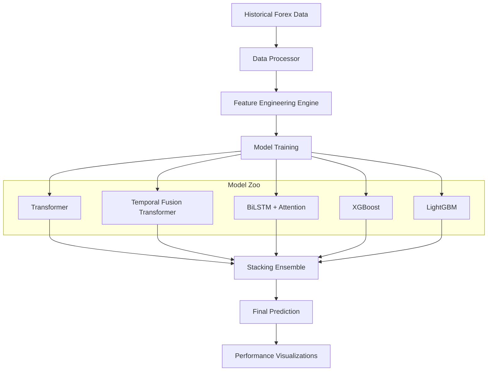

# 📈 Advanced Multi-Factor Forex Prediction System

[](https://www.python.org/downloads/)
[](https://tensorflow.org)
[](https://opensource.org/licenses/MIT)

A high-performance, multi-factor forex exchange rate prediction engine using a **Stacking Ensemble Architecture**. This system combines Deep Learning (Transformers, TFT, BiLSTM) with Gradient Boosted Trees (XGBoost, LightGBM) to capture both long-term temporal dependencies and non-linear feature interactions.

## 🚀 Key Features

- **Ensemble Intelligence**: Meta-learner (Ridge) stacking the outputs of 7+ diverse models.
- **Deep Learning Suite**:
  - **Transformer & TFT**: With residual connections and multi-head attention.
  - **BiLSTM + Attention**: For bidirectional context and feature focus.
  - **GRU/LSTM**: Robust recurrent baselines.
- **Tree Models**: Optimized XGBoost and LightGBM with per-currency feature engineering.
- **Advanced FE**: 40+ features including MACD, RSI, Bollinger Bands, ATR, and lag-based time-series features.
- **Robustness**: Per-currency IQR outlier removal and Huber loss for outlier-heavy forex data.
- **Explainability**: SHAP integration for global feature importance analysis.

## 🏗️ Architecture



## 🛠️ Setup & Installation

1. **Clone the repository**:

   ```bash
   git clone https://github.com/yourusername/forex-prediction.git
   cd forex-prediction
   ```

2. **Install dependencies**:

   ```bash
   pip install -r requirements.txt
   ```

3. **Run the training pipeline**:

   ```bash
   python forex_prediction.py
   ```

## 📊 Results Visualization

The system generates comprehensive plots in the `outputs/` directory:

- **Actual vs Predicted**: Per-model comparison.
- **Loss Curves**: Training/Validation monitoring.
- **SHAP Importance**: Understanding what drives the predictions.
- **Metrics Heatmap**: Comparative analysis across all models.

## ⚖️ License

Distributed under the MIT License. See `LICENSE` for more information.
